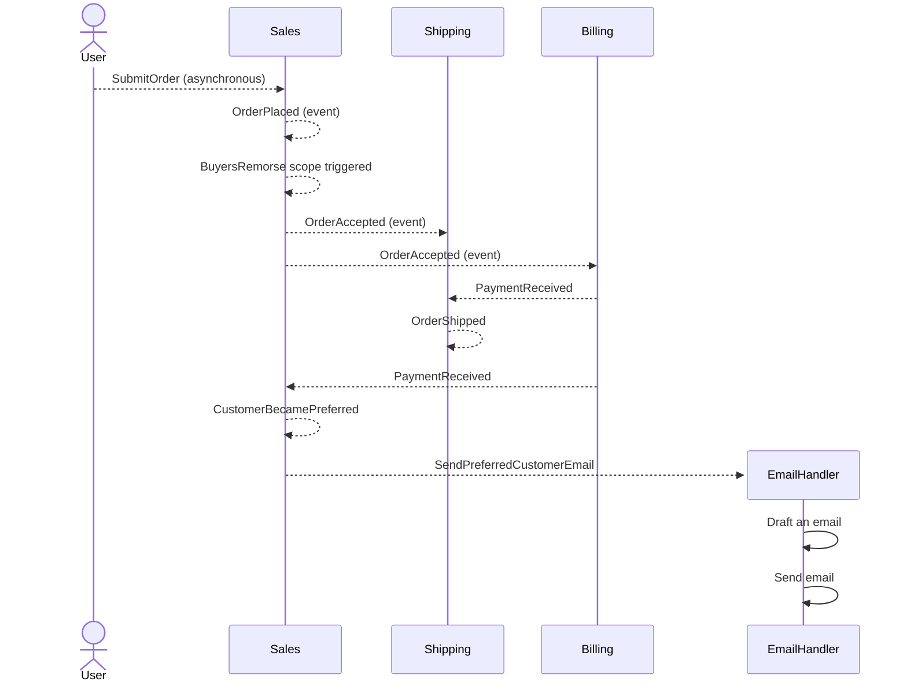

# Get the message?

This repository contains the source code of the demos for my conference session titled "[Get the message? Choosing a messaging framework for your .NET applications](https://sessionize.com/s/roycornelissen/get-the-message-choosing-a-messaging-framework-for/84016)".

In this demo, I am comparing the following frameworks:

- [NServiceBus](https://particular.net/nservicebus)
- [MassTransit](https://masstransit.io/)
- [Wolverine](https://wolverinefx.net/)
- [Dapr](https://dapr.io/)

The demo also shows how they can be made interoperable through using messaging standards like [CloudEvents](https://cloudevents.io/).

## Flow

